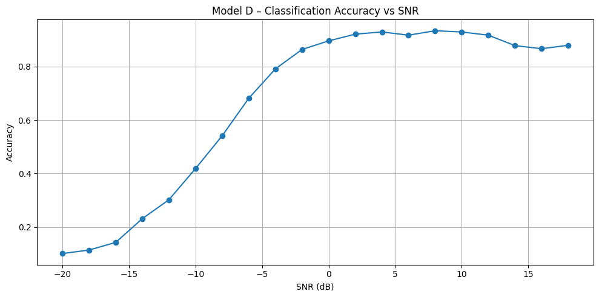
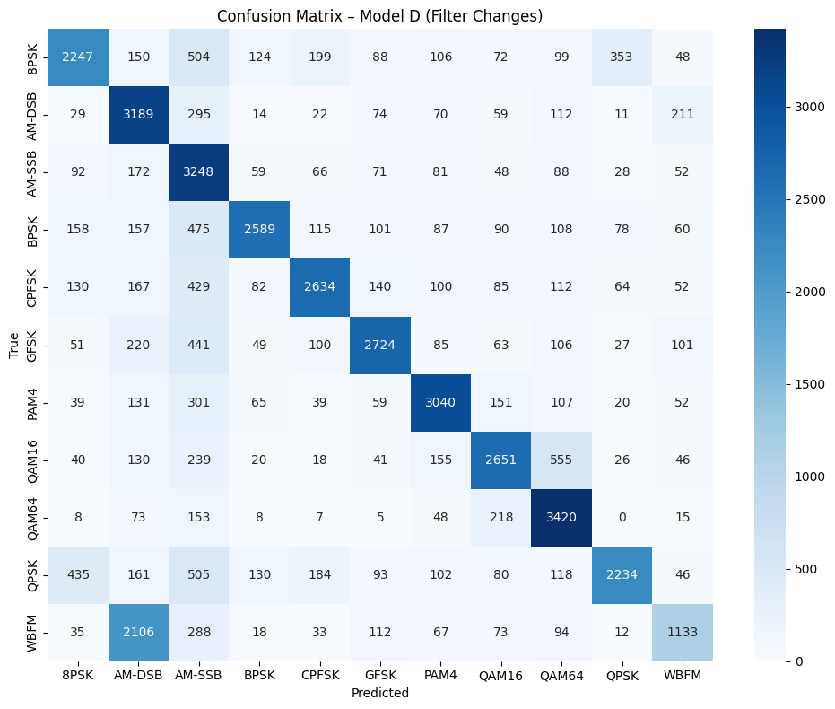

# Automatic Modulation Classification (AMC)

This repository implements and compares deep learning models for Automatic Modulation Classification (AMC) on the RadioML 2016.10A dataset. Developed as part of a final-year project at the University of Bristol, this work explores a variety of architectures including CNNs, LSTMs, Transformers, GANs, and Autoencoders, with a focus on SNR-aware fusion.

The best-performing model is a Residual CNN with SNR input fusion, achieving 66.16% test accuracy.

---

## Features

- Preprocessing with normalization and SMOTE class balancing  
- Residual CNN with SNR input branch  
- Data augmentation: phase jittering, amplitude scaling  
- Multiple architectures (A–M): Baseline CNN, DNN, LSTM, Transformer, GAN, Autoencoder  
- Visualization: Accuracy vs. SNR, Confusion Matrix

### Model Overview

| Model ID | Architecture Type           | Notes                          |
|----------|-----------------------------|--------------------------------|
| Basic    | Baseline CNN                | Single Conv1D + Dense layers   |
| A–F      | CNN Variants                | Filters, depth, dropout tuning |
| D        | Residual CNN + SNR fusion   | Main optimized model           |
| G        | Fully Connected DNN         | Simple dense-only              |
| H        | LSTM                        | 1-layer LSTM                   |
| I        | CNN + LSTM Hybrid           | Conv + temporal features       |
| J        | Transformer                 | Tokenized input                |
| K        | GAN Architecture            | Generator + Classifier         |
| M        | Autoencoder + Classifier    | Encoder + FC layer             |

## Visualization
### Model D Architecture  

### Confusion Matrix  

